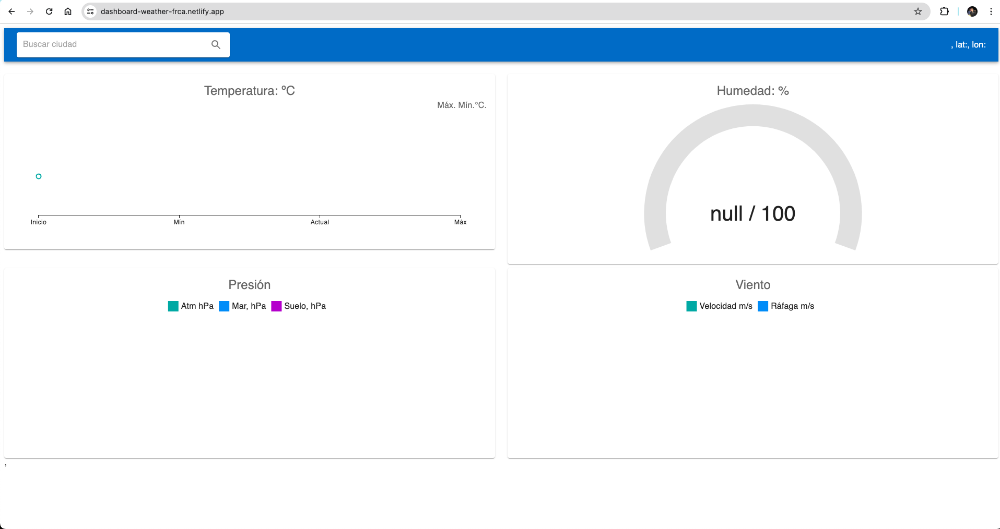
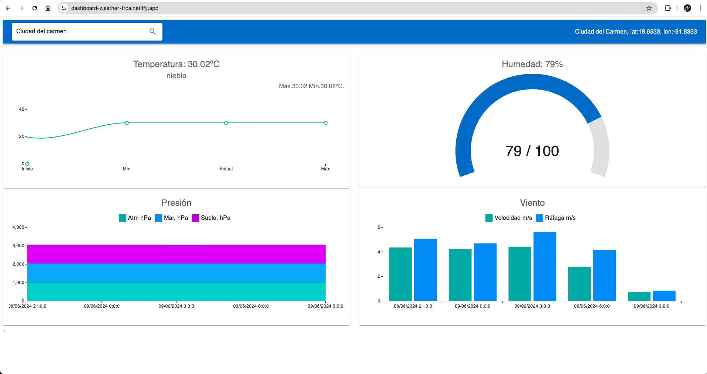
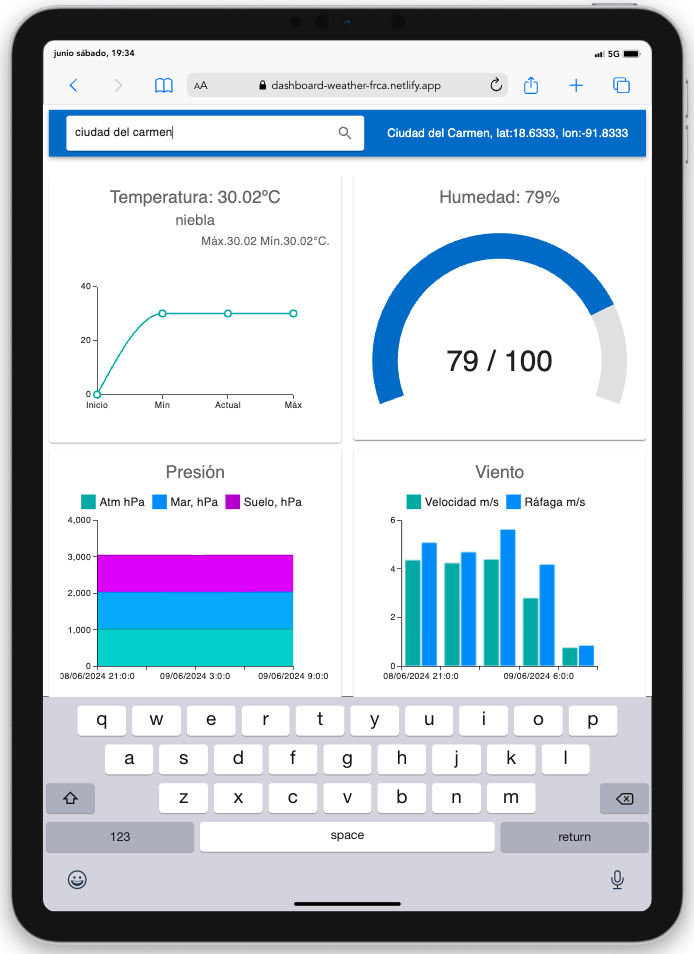
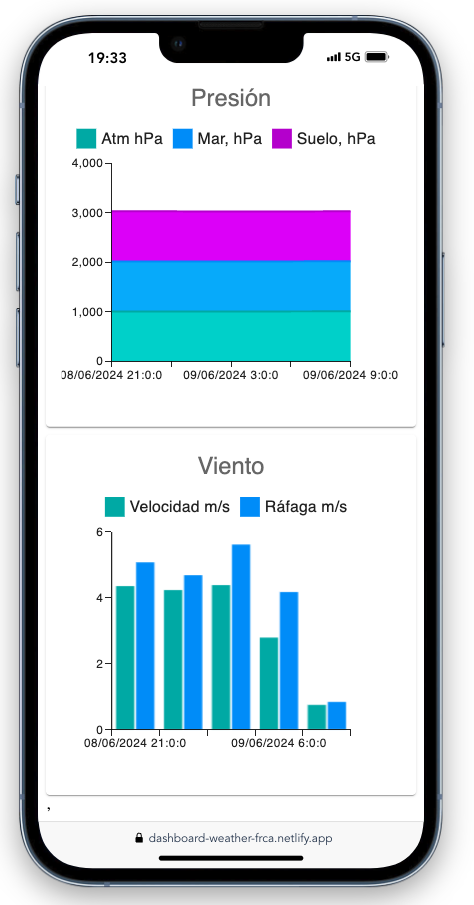

# React + Vite

# Aplicación de Monitoreo Meteorológico

Esta aplicación proporciona cuatro dashboards para monitorear diferentes parámetros meteorológicos: temperatura, humedad, pronóstico de presión y velocidad del viento. 
Para visualizar los parámetros antes mencionados, el usuario deberá ingresar el nombre de la ciudad en el buscado.

## Tabla de Contenidos

1. [Descripción](#descripción)
2. [Requisitos](#requisitos)
3. [Instalación](#instalación)
4. [Configuración](#configuración)
5. [Ejecución](#ejecución)
6. [Uso](#uso)
7. [Contribuir](#contribuir)
8. [Licencia](#licencia)

## Descripción

La aplicación de monitoreo meteorológico está diseñada para proporcionar información en tiempo real por ciudad sobre:
- **Temperatura**: Dashboard para monitorear la temperatura actual y sus variaciones.
- **Humedad**: Dashboard para visualizar la humedad ambiental.
- **Pronóstico de Presión**: Dashboard que muestra el pronóstico de la presión atmosférica.
- **Velocidad del Viento**: Dashboard para observar la velocidad del viento.

Cada uno de estos dashboards está diseñado para proporcionar datos precisos y actualizados, ayudando a los usuarios a comprender mejor las condiciones meteorológicas.

### Dashboard carga inicial



### Carga con valores



### Dispositivo Ipad



### Dispositivo Mobile



## Requisitos

- [Node.js](https://nodejs.org/) (versión 14 o superior)
- [yarn](https://classic.yarnpkg.com//) 
- [Git](https://git-scm.com/)


## Instalación

1. Clona el repositorio de la aplicación:

    ```sh
    git clone https://github.com/fausto91/weather-app.git
    ```

2. Navega al directorio del proyecto:

    ```sh
    cd weather-frontend
    ```

3. Instala las dependencias necesarias:

    ```sh
    yarn install
    ```

## Configuración

1. Crea un archivo `.env` en la raíz del proyecto y configura las siguientes variables de entorno:

    ```env
    REACT_APP_API_KEY=your_api_key_here
    REACT_APP_API_URL=https://api.openweathermap.org/data/2.5/
    ```

   Reemplaza `your_api_key_here` con tu clave de API y `https://home.openweathermap.org/api_keys` con la URL de la API del proveedor de datos meteorológicos.

## Ejecución

1. Inicia la aplicación en modo de desarrollo:

    ```sh
    yarn dev
    ```

2. Abre tu navegador web y navega a `http://localhost:5173` para ver los dashboards.

## Uso

Una vez que la aplicación esté en ejecución, en el buscardor agregar el nombre de la ciudad de tu preferencia y podrás ver los siguientes dashboards:

- **Dashboard de Temperatura**: Muestra la temperatura actual y las tendencias históricas.
- **Dashboard de Humedad**: Visualiza la humedad actual y las variaciones a lo largo del tiempo.
- **Dashboard de Pronóstico de Presión**: Proporciona un pronóstico de la presión atmosférica para los próximos días.
- **Dashboard de Velocidad del Viento**: Muestra la velocidad actual del viento y las predicciones.


## Contribuir

Las contribuciones son bienvenidas. Por favor, sigue los siguientes pasos para contribuir:

1. Haz un fork del repositorio.
2. Crea una nueva rama con tu característica o corrección de errores: `git checkout -b feature/nueva-caracteristica`
3. Realiza tus cambios y haz commit de ellos: `git commit -m 'Añadir nueva característica'`
4. Envía tus cambios a tu fork: `git push origin feature/nueva-caracteristica`
5. Abre un pull request en GitHub.

## Licencia

Este proyecto está licenciado bajo la Licencia MIT. Consulta el archivo [LICENSE](LICENSE) para más detalles.
